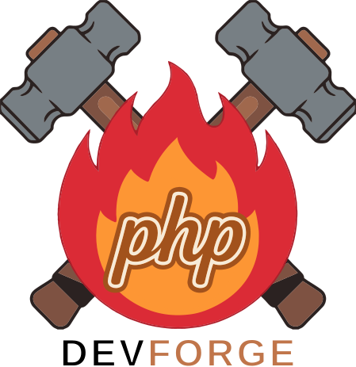

<p align="center">
  
</p>

# PHP DevForge

[](LICENSE)
[](https://github.com/zelti/php-devforge/actions/workflows/ci.yml)

[]()

**English** · [Español](README.es.md)

A local PHP environment where **the folder structure is the configuration**.

> Unlike tools built around per-project configuration, PHP DevForge derives domains
> straight from your folder structure. No config files, no init commands: create the
> folder and the site exists.

---

## ⚡ How it works

Every folder under `~/php-devforge/` is a site. The host name is its path, read from
the inside out and joined with `--`:

```
~/php-devforge/projects/my-app/public/
                     ↓
https://public--my-app--projects.phpforge.dev
```

Nothing to register, nothing to restart. Create the folder, reload the browser.

### Want a shorter URL?

That name is honest, but long. Link the project into `sites/` and it answers on its
own name as well:

```bash
forge link ~/php-devforge/projects/my-app/public
→ https://my-app.phpforge.dev
```

```
~/php-devforge/sites/
├── my-app        →  https://my-app.phpforge.dev
├── shop          →  https://shop.phpforge.dev
└── api/v2        →  https://v2--api.phpforge.dev
```

The long URL keeps working. The short one is an extra name, not a replacement — both
reach the same folder.

**Any PHP version, per request:**

```
https://my-app.phpforge.dev          # your default
https://my-app--p83.phpforge.dev     # this request on PHP 8.3
https://my-app--p85.phpforge.dev     # this request on PHP 8.5
```

Same code, any version you installed, no restart and no switching. Useful for
checking an upgrade before committing to it.

Everything is served over **real HTTPS** with a locally trusted certificate.

## 🧭 How it compares

|  | PHP DevForge | [Herd](https://herd.laravel.com) | [DDEV](https://ddev.com) |
|---|---|---|---|
| Domain from folder name | ✅ | ✅ | ❌ per-project config |
| **Nested paths** (`v2--api--sites`) | ✅ any depth | ❌ one level | ❌ |
| **PHP version per request** (`--p85`) | ✅ from the URL | ❌ per site | ❌ per project |
| Linux | ✅ | ❌ macOS/Windows | ✅ |
| Runs in Docker | ✅ | ❌ native | ✅ |
| Local HTTPS | ✅ | ✅ | ✅ |
| `.htaccess` | ✅ Apache | ✅ | ✅ |

DDEV gives you a per-project, reproducible definition — better when each project
needs a different stack. Herd is the fastest native option on macOS. PHP DevForge is
for keeping many projects on one shared environment with no per-project setup.

## 📖 What you get

- **Apache + PHP-FPM 8.3, 8.4 and 8.5** — install the ones you want, chosen per request
- **Automatic HTTPS** with a locally trusted CA
- **Wildcard local DNS** that only touches your dev domain
- **Live editing** — files are mounted, nothing to sync
- **Files stay yours** — containers adopt your user id, so no `sudo` and no
  unremovable `node_modules`
- **Xdebug** on a toggle, **Composer**, **Node 24**, **pnpm**
- Optional **PostgreSQL**, **Elasticsearch** and **Kibana**

## 🚀 Quick start

```bash
git clone https://github.com/zelti/php-devforge.git
cd php-devforge
./install.sh            # asks a few questions, sets everything up
forge start
```

Then open **https://welcome.phpforge.dev**.

## 🔧 Installation

### 📋 Prerequisites

- Docker and Docker Compose (also used to generate the SSL certificates)
- Git
- Bash shell (Linux/macOS)

### 🚀 Setup Steps

1. **Clone the repository:**
   ```bash
   git clone git@github.com:zelti/php-devforge.git
   cd php-devforge
   ```
    Clone it wherever you like: the scripts and aliases resolve their own location.

2. **Run the installer:**
   ```bash
   ./install.sh
   ```
   It asks for your domain, where your projects should live, which PHP versions to
   install and which of them is the default, finds a free DNS port, detects your user
   id, writes `.env`, creates the projects folder, and offers to generate the
   certificates and configure local DNS.

   Safe to re-run: your current `.env` supplies the defaults. For unattended use:
   ```bash
   ./install.sh --yes --domain=mydomain.dev --projects-dir=~/code
   ./install.sh --yes --php=84,83             # two versions, 8.4 the default
   ./install.sh --yes --profiles=pg18,mail    # databases and mail, unattended
   ./install.sh --help                        # every option
   ```

   Nothing needs `sudo` except the DNS step, and only if you accept it.

3. **Use it from anywhere:**
   The installer links `forge` into `~/.local/bin`, so the command works from any
   directory and in any shell. `forge help` lists everything.

4. **Start the containers:**
    ```bash
    forge start
    ```
    Or `forge start`, which works from anywhere.

    Check it works: `https://welcome.phpforge.dev` — the page reports what is
    actually running: the PHP version and web server answering, which other
    versions are installed, and which databases and mail are up.

### 🧹 Uninstalling

```bash
forge uninstall --dry-run    # what it would remove, changing nothing
forge uninstall              # do it
```

It undoes the install in reverse: the containers, the network and the images,
the `forge` symlink, the local DNS entry, the trusted CA (system store *and*
Firefox/Chrome), and the files the installer generated — `.env`,
`certificates/`, `.caroot/`.

**Your data is never assumed.** The database volumes and your projects folder
are each a separate question, both answered "no" by default, and `--yes` keeps
them. Take them too with `--volumes` and `--projects`. Your
`docker-compose.local.yml` and `custom/php.d/` files are always left alone.

It prints everything it will touch, with sizes, before touching any of it. The
last thing it says is how to delete the checkout, which is the one part it will
not do for you.

## 💻 Usage

### ▶️ Starting and Stopping

```bash
forge start                  # start everything
forge stop
forge restart
forge status                 # what is running, and how it is configured

forge link ~/code/app/public # publish a project at app.<domain>

forge php list               # PHP versions, and which are installed
forge php on|off 8.3         # install one, or free the ~2 GB it uses
forge use 8.5                # set the default version (installs it if needed)
forge run composer install   # run a command in the right container
forge shell 8.4              # open a shell in a container
forge logs 8.4               # follow its logs

forge profile list           # optional services, and which are on
forge profile on|off <name>  # turn one on or off
forge db list                # the databases among them
forge mail on|off            # a mail catcher at mail.<domain>

forge images build|pull      # build locally, or use the published images
forge certs                  # regenerate the certificates
forge dns status             # inspect the local DNS
forge skill status           # teach the AI agents here how to use this

forge uninstall              # undo the install (see below)
forge version
forge help
```

`forge` works from any directory, in any shell. The installer links it into
`~/.local/bin`. Version arguments accept `8.5` or `85`, and the available versions
come from `docker-compose.yml` — add a service and `forge use 8.6` just works.

It is a wrapper around `docker compose`, not a replacement for it: nothing is
hidden and the raw commands still work from the project directory. It exists so
the things you do daily are one word, and so the ones with a trick to them — a
relative symlink the containers can follow, nginx and Apache not fighting over
port 80 — are right without you remembering why.

### 🌐 Accessing Your Projects

1. **Create project structure:**
   Your projects live in the folder you chose during install (`PROJECTS_DIR` in
   `.env`, `~/php-devforge` by default). The installer creates it with:

   ```
   ~/php-devforge/
   ├── projects/          your actual code
   └── sites/             one symlink per project, for shorter URLs
       └── welcome/       a test page
   ```

   Inside the containers this is always `/home/php-devforge/public_html`, which is
   where Apache and PHP look. Only the host side is configurable.

   **Two ways to reach the same project.** `sites/` is a shortcut: it is tried
   first, and the full path from the root is the fallback.

   | URL | Serves |
   |---|---|
   | `my-app.phpforge.dev` | `sites/my-app` |
   | `v2--api.phpforge.dev` | `sites/api/v2` |
   | `public--my-app--projects.phpforge.dev` | `projects/my-app/public` |

   So you can publish deliberately with a short name, or reach any folder by its
   full path without linking anything.

   **Publishing:** `forge link <folder> [name]` creates the symlink for you. It uses
   the project directory as the name when the folder is called `public` (as every
   framework's is), makes the link **relative** so it resolves inside the containers
   too, and refuses a folder outside `PROJECTS_DIR` — the containers see nothing
   else, so such a link would 404.

   By hand it is:

   ```bash
   cd ~/php-devforge
   ln -s ../projects/my-app/public sites/my-app
   ```

   No `chown` is needed. The PHP containers adopt your user id at startup
   (`PUID`/`PGID` in `.env`), so files they create belong to you and `node_modules`
   can be deleted without `sudo`.

2. **URL Structure:**
   Projects are accessible via automatically generated URLs:
   - `folder/project/public/index.php` → `https://public--project--folder.phpforge.dev`
   - The URL is constructed by reversing the folder path segments separated by `--`

3. **PHP Version Switching:**
   Append `--pNN` to the host to pick a version for that request only:
   - `https://my-app--sites.phpforge.dev` — the default from `.env`
   - `https://my-app--sites--p83.phpforge.dev` — PHP 8.3
   - `https://my-app--sites--p84.phpforge.dev` — PHP 8.4
   - `https://my-app--sites--p85.phpforge.dev` — PHP 8.5

   The backend is derived from the host name, so adding a PHP version needs no
   configuration change — only a service in `docker-compose.yml`.

### 🐘 PHP versions

You pick them at install time, the same way you pick databases, because each one
is a separate image of about 2 GB:

```bash
forge php list        # 8.3 off / 8.4 ON default / 8.5 off
forge php on 8.3      # pull it and start it
forge php off 8.3     # stop it; the image stays on disk until you prune it
```

One of them is the **default**: it answers every host name without a `--pNN`
suffix. `forge use 8.5` moves it, installing that version first if you do not have
it, and `forge php off` refuses to remove the default — otherwise nothing would
answer a plain host name.

Asking for a version you did not install returns a page that says so and names the
command to add it, rather than a bare 503.

### 🔄 Development Workflow

- Edit code in your editor — the files are volume-mounted, so changes are live
- Nothing to restart for a code change
- Open a shell in a container with `forge shell 8.4`
- Watch what is happening with `forge logs`

### ⚙️ Running commands in a project

`forge run` runs one command inside the right container, in the folder you are in:

```bash
cd ~/php-devforge/projects/my-app
forge run composer install
forge run pnpm run build
forge run php artisan migrate

forge run -p 8.3 php -v                    # a different version, just this once
forge run -C projects/my-app pnpm build    # from anywhere
```

It exists because the hand-written form has four ways to go wrong. The projects
folder is mounted at a different path inside, so the host path fails with
`chdir ... no such file or directory`. The user is `php-devforge`, not root.
Node and pnpm come from nvm and are only on the PATH of a **login** shell, so
without one they look uninstalled. And `-it` fails outright when nothing is a
terminal — `forge run` adds it only when there is one, which is also what keeps
escape codes out of captured output.

The command's own exit status comes back, so it works in a script.

### 🐞 Xdebug

Inside a container:

```bash
xdebug                    # toggle it on or off
xdebug --force-activate
xdebug /path/script.php   # run one script with it on, then turn it back off
```

Point your editor at port **9003**, the Xdebug 3 default.

## 🌐 Local DNS

The installer offers to set this up. It routes **only** your development domain to
the stack's dnsmasq; the rest of your DNS is untouched, so stopping the containers
never costs you internet access.

```bash
forge dns setup     # apply
forge dns status    # show what is configured
forge dns test      # check resolution
forge dns remove    # undo: deletes one file
```

These call `./setup-local-dns.sh`, which you can also run directly with the same
options as `--flags`.

dnsmasq listens on `127.0.0.1:${DNS_PORT}` rather than port 53, which is usually
taken by systemd-resolved, Pi-hole or similar. The installer picks a free port and
writes it to `.env`; change it there if you need to.

Supported: Linux with systemd-resolved, and macOS via `/etc/resolver`. On anything
else the script prints instructions and **changes nothing**, rather than rewriting
your DNS in a way that could break when the containers are down.

## ✏️ Customising Without Breaking Upgrades

**Do not edit anything under `docker-library/`.** Those files change with every
release, so your edits will conflict on `git pull` — and a copy kept aside is
worse: it stops receiving fixes, silently. Use these instead. All three are
ignored by git.

**PHP settings — no rebuild.** Drop a file in `custom/php.d/`:

```ini
; custom/php.d/99-mine.ini
memory_limit = 512M
upload_max_filesize = 100M
```

```bash
forge restart
```

It is scanned *in addition to* the image's own config, so nothing is shadowed and
the Xdebug toggle keeps working.

**For one version only** — same idea, in that version's folder:

```ini
; custom/8.3/php.d/99-mine.ini
memory_limit = 1G
```

Read after the shared folder, so it wins where the two collide, and no other
version sees it. Everything under `custom/<version>/` is mounted in that
container, so it is also where per-version things other than `.ini` files go.

**Your own services** — `docker-compose.local.yml`, loaded automatically:

```yaml
services:
  redis:
    image: redis:7-alpine
    ports:
      - 127.0.0.1:6379:6379
```

The same file overrides anything in the shipped compose files: ports, volumes,
environment.

**Extra PHP extensions or system packages** — extend the image instead of copying
its Dockerfile, so you keep getting upstream fixes:

```dockerfile
# custom/php/Dockerfile
FROM ghcr.io/zelti/php-devforge/php:8.4-dev
RUN sudo pecl install mongodb && sudo docker-php-ext-enable mongodb
```

```yaml
# docker-compose.local.yml
services:
  php84dev:
    build:
      context: ./custom/php
```

## 📦 Pull or Build the Images

By default the environment uses prebuilt images from `ghcr.io`, so the first run
takes about a minute instead of the ~15 it takes to compile PHP extensions, PECL
and Node. The installer asks which you want, and you can change your mind at any
time with one line in `.env`:

```bash
IMAGE_MODE=missing   # use the published images (default)
IMAGE_MODE=build     # always build locally
IMAGE_MODE=always    # re-pull every time, to force the newest published image
```

Then `forge start`. Or skip the editing: `forge images build` and `forge images pull`
set that line and restart for you.

Pick `build` if you edit anything under `docker-library/`: your changes are picked
up automatically, and Docker's layer cache makes it cheap when nothing changed.
Either way an image still gets built on demand, and compose falls back to building
if one cannot be pulled.

**Note:** settings baked in at build time — `NODE_VERSION`, for instance — only
apply when you build. A pulled image already has them fixed.

## 🗄️ Databases and Mail

Nothing starts unless you pick it. The installer asks; afterwards:

```bash
forge db list              # what exists, and what is on
forge db on pg18
forge db off mariadb12
forge mail on              # a mail catcher at mail.<domain>
```

| Name | Image | Port on your machine |
|---|---|---|
| `pg16` `pg17` `pg18` | postgres 16 / 17 / 18 | 5416 / 5417 / 5418 |
| `mariadb11` `mariadb12` | mariadb 11.8 LTS / 12 | 3311 / 3312 |
| `mail` | Mailpit | web UI at `https://mail.<domain>` |

The ports encode the version, so several can run at once — handy for testing a
migration against the version you will deploy to.

**From your code**, reach them by container name on the shared network:

```php
new PDO("pgsql:host=postgres18dev;port=5432;dbname=php-devforge", $user, $pass);
new PDO("mysql:host=mariadb12dev;port=3306;dbname=php-devforge", $user, $pass);
```

Credentials are `USER_DEV` / `PASSWD_DEV` from `.env`. The host ports above are for
your own tools — a GUI client, `psql`, a migration script.

**Mail**: point your framework's SMTP settings at `mailpit:1025`, no auth and no TLS.
Everything sent is captured and shown at `https://mail.<domain>`; nothing leaves
your machine.

## 🧩 Optional Services

Some services are not started by default. They carry a compose `profile`, so you
ask for them when you want them:

```bash
forge profile list                 # what exists, and what is on
forge profile on search            # Elasticsearch + Kibana
forge profile off search
```

The listing reads the compose files, so it stays right on its own: each row shows
the images that profile starts.

| Profile | Services | Notes |
|---|---|---|
| *(none)* | apachedev, dnsmasq | started by `forge start` |
| `php83` `php84` `php85` | php83dev, php84dev, php85dev | pick them at install, or `forge php on 8.3` |
| `pg16` `pg17` `pg18` | postgres | see the Databases and Mail section |
| `mariadb11` `mariadb12` | mariadb | same |
| `mail` | mailpit | UI at `https://mail.<domain>` |
| `search` | es8143dev, kibana | Kibana on `127.0.0.1:5601` |
| `tools` | mkcert | used by `install_cert.sh`; not a long-running service |
| `nginx` | nginxdev | **replaces** apachedev; see below |

Which of these start is `COMPOSE_PROFILES` in `.env`, a comma-separated list. The
installer sets it, `forge db` and `forge mail` edit it, and you can also edit it by
hand:

```bash
COMPOSE_PROFILES=pg18,mariadb12,mail
```

Anything not listed there is defined but never started.

### nginx instead of Apache

Apache is the default because it supports `.htaccess`, which nginx does not. If you
would rather run nginx, it is there — as an alternative, not an addition, since both
want ports 80 and 443:

```bash
forge profile on nginx     # stops apachedev; they cannot share the ports
forge profile off nginx    # and brings it back
```

It serves the same URLs, including nested paths and the `--pNN` version suffix —
for projects whose files map to URLs.

**Frameworks route under it too**, which they normally do not on nginx. Laravel,
Symfony and WordPress put their routing rule in `.htaccess`, and nginx does not read
`.htaccess` — that is a design decision of nginx, not a setting. But the Lua that
already resolves the document root reads that **one** rule and hands it to a
`try_files` fallback:

```apache
RewriteCond %{REQUEST_FILENAME} !-d      # what try_files $uri $uri/ means
RewriteCond %{REQUEST_FILENAME} !-f
RewriteRule ^ index.php [L]              # the target it falls back to
```

A built SPA declares the same thing with `index.html` as the target, and that is
served rather than passed to PHP. So a project routes if it says it wants to, and one
that does not — a static site, a folder of `.php` pages — keeps answering `404` for
URLs that are not files. Set `NGINX_FRONT_CONTROLLER` in `.env` to change that:

| | |
|---|---|
| `auto` (default) | honour the rule the project declares in its `.htaccess` |
| `always` | treat `index.php` as the front controller even with no `.htaccess` — Symfony without `apache-pack`, WordPress before its permalinks are saved |
| `off` | plain nginx: `404` for anything that is not a file |

**Only the routing rule is read.** Deny rules, `AuthType`, headers and everything
else in a `.htaccess` stay ignored under nginx, and always will. One corner also
differs: a URL ending in `.php` inside a project whose front controller is an
`index.html` answers `404` here and the shell under Apache. That is still the reason
Apache is the default.

It is **OpenResty**, not stock nginx: the document root and the PHP backend are
derived from the host name in Lua, which plain nginx cannot do. Swapping the base
image for `nginx:alpine` will not work.

They are real service definitions rather than commented-out YAML, so
`docker compose config` and CI keep checking them and they cannot quietly break.

## 🤖 AI agents

The repo carries a skill file, `skills/php-devforge/SKILL.md`, that teaches an AI
coding agent how this environment works: `forge run` instead of `docker exec`,
how a folder becomes a URL, the database and SMTP settings, what is live and what
needs a restart, and the traps.

The installer offers to hook it up, and afterwards:

```bash
forge skill status     # which agents were found, and which are hooked up
forge skill on         # all of them, or: forge skill on codex
forge skill off
forge skill path       # print the file, to point anything else at it
```

An agent is only offered the skill when its configuration folder already exists,
so nothing is created for a tool you do not use. Two shapes, because agents load
instructions differently:

| Agent | How |
|---|---|
| Claude Code | a symlink in `~/.claude/skills/`, loaded on demand |
| Codex, Gemini, opencode | a delimited block in their global instructions file |

The block is short on purpose — a global instructions file is in context for
every session, so it gets a summary and the path to the full file. It sits
between `<!-- php-devforge:start -->` and `<!-- php-devforge:end -->`, is
rewritten in place rather than appended, and `forge skill off` takes out the
block and the blank line before it, leaving the rest of the file untouched.

## 🛠️ Supported PHP Extensions and Tools

**PHP extensions:** GD, Intl, Zip, PDO MySQL, PDO PostgreSQL, SOAP, XSL, BC Math,
OPcache, Mbstring, Exif, PCNTL, Imagick, Redis, APCu, Xdebug

**Tools:** Composer, Node.js 24 LTS via NVM, pnpm, Git, Cron

`NODE_VERSION` in `.env` sets the Node version, and applies when you build your own
images — a pulled image already has it fixed. `npm` still works but points you at
pnpm. Xdebug is off until you turn it on with the `xdebug` command inside a
container; your IDE should listen on port **9003**.

## 🐛 Troubleshooting

- **The domain stopped resolving after re-installing**: `forge dns status` now puts
  the three numbers that must agree next to each other — the port your system asks
  for, the one in `.env`, and the one dnsmasq publishes. When they differ,
  `./setup-local-dns.sh` repoints the system at the port in use.
- **DNS not resolving**: run `forge dns status` and `forge dns test`. You may need to
  restart your browser.
- **SSL certificate not trusted**: re-run `forge certs` and restart your browser.
  Firefox keeps its own trust store on Linux: install `nss` (Arch) or `libnss3-tools`
  (Debian/Ubuntu) and try again.
- **Containers not starting**: check Docker is running and that ports 80 and 443 are
  free.
- **Permission issues under `public_html`**: check `PUID`/`PGID` in `.env` match your
  own (`id -u`, `id -g`), then `forge restart`. The containers adopt those ids on
  startup, so files they write belong to you.
- **PHP version not switching**: check `PHP_VERSION` in `.env`, or append
  `--p83`/`--p84`/`--p85` to the host name. `forge status` prints the default.
- **"PHP 8.3 is not installed"**: that version was not picked at install time.
  `forge php on 8.3` adds it; `forge php list` shows what you have.
- **`npm` prints a notice about pnpm**: deliberate. npm still works; pnpm is preferred
  here.
- **An `.ini` in `custom/php.d/` seems ignored**: recreate the container with
  `forge restart`. A plain restart does not re-read it. Check too that no
  `custom/<version>/php.d/` file overrides it — that one wins.
- **`forge: command not found`**: the installer links it into `~/.local/bin`, which
  some shells do not have on `PATH`. Add it, or `source aliases.bash` from the project
  directory.

### Two copies of the project

Every checkout uses the same compose project name, so a second clone — testing an
upgrade without touching the setup that works — does not get its own environment. It
gets the same one:

| Shared | Not shared |
|---|---|
| the containers | your code, in whichever folder each `.env` points at |
| the database volumes | the `.env` itself: domain, PHP version, projects folder |
| ports 80 and 443 | the certificates in `certificates/` |

Starting from the second folder reconfigures the running containers rather than
creating new ones. `forge` asks first, and `forge status` names the folder that
started them:

```
[!] These containers were started from:
      ~/Projects/other-copy
    To go back:  cd ~/Projects/other-copy && forge start

    Take them over? [y/N]
```

`forge --force <command>` skips the question, which is also what you need where
there is no terminal to answer on.

**Your code is never at risk**: it is a folder on your disk, mounted in. What the two
folders genuinely share is the database data, which lives in a Docker volume named
after the project rather than after the folder. `forge` has no command that deletes
it — but `docker compose down -v`, typed by hand in either folder, reaches both.

For more help, check the logs with `forge logs` — or `forge logs apachedev` for one
service — or open an issue on GitHub.

## 🤝 Contributing

1. Fork the repository and create a branch
2. Make your changes
3. Check that CI passes — it installs and runs the whole thing on a clean machine,
   so it catches a fair amount
4. Open a pull request describing what changes and why

CI builds all three PHP versions, runs the installer, configures DNS, checks that a
`.php` is never served as source, that files created in the containers belong to
you, and that both Apache and nginx serve the same sites. If it is green, it works
somewhere other than your laptop.

### Releasing

The version lives in one file, `VERSION`, and `forge version` prints it with the
commit you are on:

```bash
$ forge version
PHP DevForge 0.1.0 (c45e1f3)
```

To cut one: bump `VERSION`, commit, then tag it.

```bash
git tag v0.1.0 && git push origin v0.1.0
```

CI refuses a `VERSION` that is not semver, and a tagged commit whose tag and
`VERSION` disagree — so the two cannot drift.

### Running a CI step before you push

A round trip through GitHub is six minutes, and most failures are not in the code
but in the step itself: a flag you passed locally and CI does not, a value an
earlier step was supposed to set, a pipeline that behaves differently under
`pipefail`. So run the step as written instead of retyping it:

```bash
forge start                                   # the steps need the stack up

.github/scripts/run-step.py                   # list every step
.github/scripts/run-step.py "the forge command works"
.github/scripts/run-step.py -x "<name>"       # trace, to find the silent grep
```

It reads `.github/workflows/ci.yml` and runs the step's `run:` block verbatim
under `bash -e`, exactly as GitHub does. Needs PyYAML; it tells you how to
install it if you do not have it.

**Steps are not independent.** Some read fixtures an earlier step created — the
`my-app` project, an enabled database — so when one fails on a missing file, run
the earlier step first. `run-step.py` with no arguments lists them in order.

The steps that fetch a page source `.github/scripts/serve.sh` for two helpers:
`serves <host> <text>` asserts a page contains something, and `serve <host>
<path>` retries for a minute and, when it gives up, says why — the status it got,
what curl said, and what was listening on 443.

**Two kinds of step cannot pass locally**, and that is expected:

| Step | Why | To run it anyway |
|---|---|---|
| the HTTPS ones | `curl` without `-k`, on purpose: it checks the system trust store | `./install_cert.sh` (asks for sudo, installs the CA) |
| the DNS ones | they rewrite the system resolver | `./setup-local-dns.sh` (asks for sudo) |

Everything else runs against your own containers.

## 📄 License

This project is licensed under the MIT License - see the [LICENSE](LICENSE) file for details.
